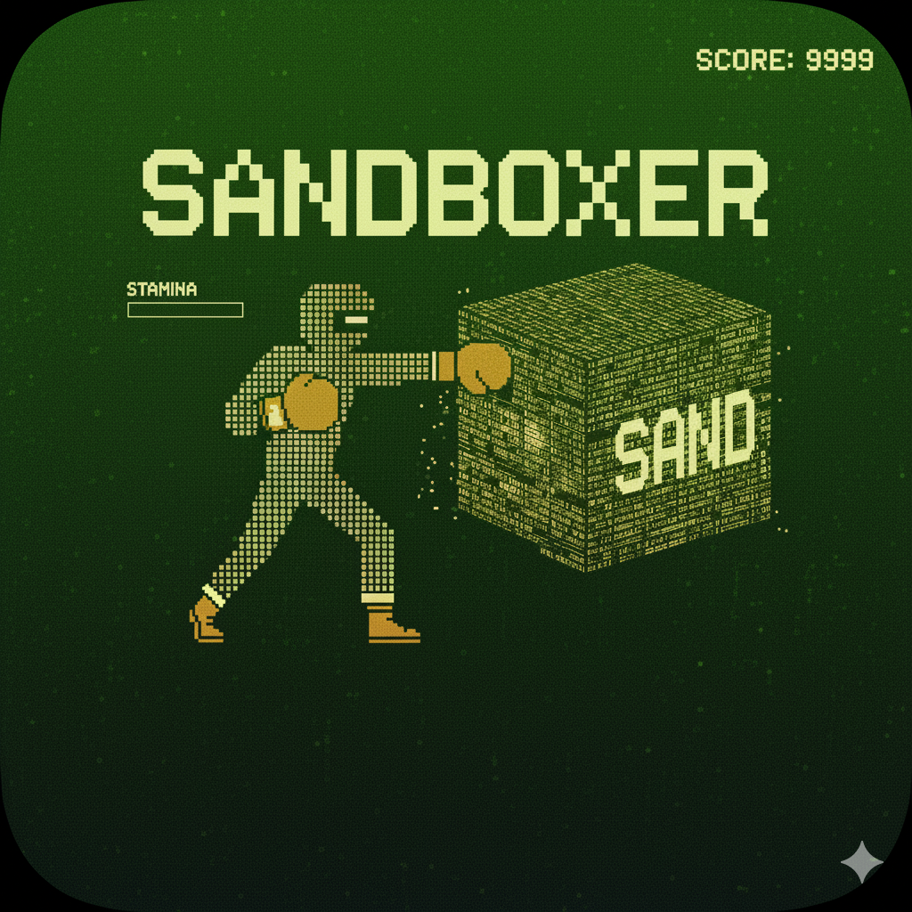

<p align="center">
  <br><br>
  <b>Sandboxer</b><br><br>
  Give Claude root access to a disposable machine and let it run autonomously.<br>
  Monitor multiple agents live, take over via SSH, or switch to chat UI on mobile.
</p>

---


## Features

- **Live previews** - See all Claude sessions at a glance in a scalable grid layout
- **Claude Chat** - Mobile-friendly chat UI as alternative to terminal view
- **SSH takeover** - `ssh -t sandboxer@host sandboxer-shell` to take over any session from terminal
- **Session persistence** - All sessions survive restarts via tmux
- **Claude Loop** - Autonomous mode: create PROMPT.md, start loop, Claude works until done


## Install

1. Install [Claude Code](https://docs.anthropic.com/en/docs/claude-code) on a dedicated/disposable machine

2. Run:
   ```bash
   claude --dangerously-skip-permissions "clone github.com/anthropics/sandboxer to /home/sandboxer/sandboxer-repo, read CLAUDE.md, then install: deps (python3 tmux ttyd caddy lazygit fzf gemini-cli), copy service files, symlink sandboxer-shell and claude-loop to /usr/local/bin, enable and start services"
   ```

3. Access at `http://<host>:8080` — default: `admin` / `admin`

4. Change password: `claude --dangerously-skip-permissions "change sandboxer password to YOUR_PASSWORD"`

5. Clone repos: `claude --dangerously-skip-permissions "clone github.com/user/repo to /home/sandboxer/git/repo"`

## Security

> **Warning**: This gives Claude complete control of a machine. Only use on a disposable VM without secrets.

## Mobile Access (Terminus/Blink)

Set `sandboxer-shell` as your SSH client's startup command:

| App | Setting |
|-----|---------|
| Terminus | Host → Startup Command → `sandboxer-shell` |
| Blink | Config → Startup Command → `sandboxer-shell` |

Then connect via SSH — you'll get folder picker → session picker → attached.

## Technical

<details>
<summary>Data Storage</summary>

All session and message data is stored in SQLite at `/etc/sandboxer/sandboxer.db`:

**Sessions table:**
```sql
CREATE TABLE sessions (
    name TEXT PRIMARY KEY,
    workdir TEXT NOT NULL,
    type TEXT NOT NULL,        -- 'claude', 'chat', 'bash', 'lazygit'
    mode TEXT,                 -- 'cli' (terminal) or 'chat' (web UI)
    title TEXT,
    claude_session_id TEXT,    -- For Claude's --resume/--session-id
    created_at TEXT,
    updated_at TEXT
);
```

Sessions use tmux for terminal persistence.

</details>


---

Built with [webtui](https://github.com/webtui/webtui)
